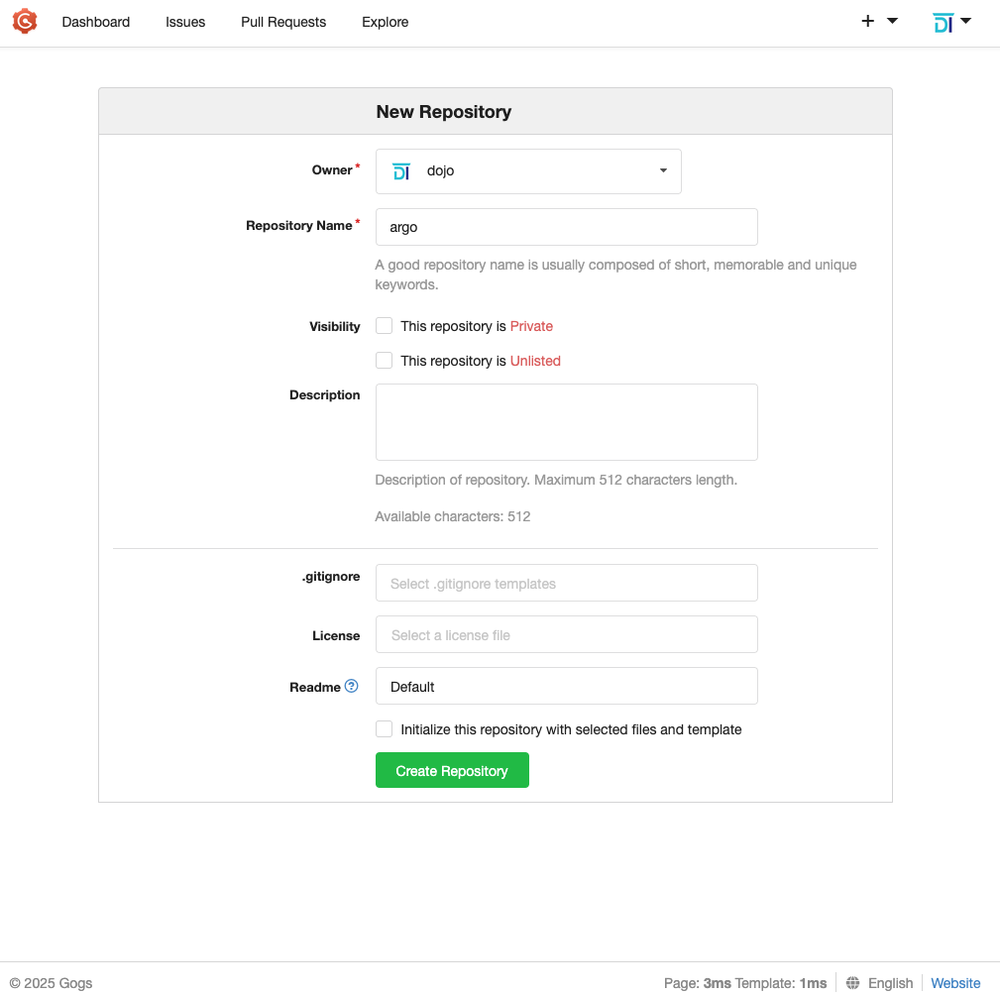

# KCD Sofia 2025


## GitOps made simple: Best Practices using ArgoCD & Kubernetes


## Overview

GitOps is a powerful approach for using Git as a single source of truth for
managing both application and infrastructure configurations. It is a specialized
methodology within the broader DevOps cultural and technical philosophy, and brings
several key benefits:

- `Repeatability`: Every deployment or configuration is versioned in Git, making
  environments easy to reproduce or redeploy.

- `Traceability`: Every change is tracked and documented as a commit, enabling
  audits and clear visibility into who made what change and when.

- `Audit and Rollback`: Since changes are version-controlled, rolling back to a
  stable state is as simple as reverting a Git commit, making rollbacks secure
  and fast.

Through Git-driven workflows, GitOps provides automation and reliability, especially
for modern cloud environments. Unlike traditional administration approaches—where
configuration changes are applied directly to the Kubernetes environment — in
GitOps every intended change is made via commits to Git, and only then is it reflected
in the cluster.


ArgoCD implements GitOps practices by continuously monitoring Git repositories
through a combination of periodic polling and webhooks. It automatically detects
changes and syncs those changes to the Kubernetes infrastructure. When a
configuration or application update is pushed to Git, ArgoCD ensures the live
cluster matches what’s described in Git, without requiring manual intervention,
thus enabling consistent, secure, and auditable operations.

Throughout this workshop, we'll see in practice how to build a simple infrastructure
based on Git, Kubernetes, and ArgoCD, and how to implement these principles hands-on.


## Prerequisites

The list of prerequisites to complete the workshop are:

>[!Note]
> No matter whether you are using Linux, Mac OS, or Windows, they all come with
> a built-in SSH client in the terminal!

- Personal laptop
- Web browser
- SSH client - built-in like openSSH or third-party like SecureCRT, MobaXterm, Putty, etc.
- Internet connectivity to the cloud infrastructure

In case you are following the instructions after the event, you can recreate
the lab environment by creating a dedicated virtual machine based on Ubuntu 24.04
linux using your prefered hypervisor (like KVM, ProxMox VE, VirtualBox, VMware
Workstation/Fusion, etc.).

The recommended minimal system requriements are:

- 2 cores
- 4 GB ram
- 15 GB disk size


## Get familiar with our hands-on environment


The remote lab (hands-on) environment is a virtual machine deployed in the cloud
and is based on Ubuntu Linux 24.04 LTS. It is only accessible over SSH.

The SSH session authentication will be based on the username: `ubuntu`
and an `SSH key` that will be shared with you at the beginning of the event.

> [!Note]
> Please don't change the default credentials!

>[!Warning]
> The handson machines are short-lived and will be destroyed immediately after
> the end of the event. Please don't store any important or sensitive data on them!

>[!Warning]
> Please don't reboot your hands-on VM as this might change its IP address.

The hands-on machine credentials are:

- username: `ubuntu`
- password: `ubuntu`

The built-in user `ubuntu` has regular user privileges. It is a member of the
`sudoers` group, and in case you need to elevate your privileges, you can use the
`sudo` command.

### Connect to the Hands-On Environment

Due to security concerns, SSH requires the private key file permissions to be set
to `400` (read-only for the owner). Let's do that first:

```shell
user@workstation:~$ chmod 400 key.pem
```

>[!Note]
> If you don't change the key permissions, the OpenSSH client might refuse it with
> a warning:

  ```shell
  @@@@@@@@@@@@@@@@@@@@@@@@@@@@@@@@@@@@@@@@@@@@@@@@@@@@@@@@@@
  @    WARNING: UNPROTECTED PRIVATE KEY FILE!              @
  @@@@@@@@@@@@@@@@@@@@@@@@@@@@@@@@@@@@@@@@@@@@@@@@@@@@@@@@@@
  ```

Throughout the hands-on we might have to create multiple ssh sessions to our
target hands-on machine. To make it easier to reference its IP address, let's
store it in a text file. In the following examples, please substitute the
references to `public.hands.on.ip` with the public IP address of your hands-on
machine provided by your instructur.

On Linux or Mac os:

```shell
echo public.hands.on.ip > ./ip.txt
```

or if you are using the OpenSSH client in Windows PowerShell:

```shell
"public.hands.on.ip" | Set-Content ip.txt
```

Next, let's log in to our dedicated hands-on machine by first initializing an
environment varialbe with the IP address:


```shell
#Windows:
$HANDSONIP = Get-Content ip.txt

#Mac/Linux:
HANDSONIP=$(cat ./ip.txt)
```

```shell
user@workstation:~$ ssh -i key.pem ubuntu@$HANDSONIP
~$
```


## Task 1. Configure the hands-on infrastructure

In this task, we'll do the initial environment setup:

- Install Docker and Kubernetes
- Verify both services are running
- Install the git server - Gogs

### Task 1.1. Installing Docker and Kubernetes

To complete the workshop exercises, we'll need a working Docker CE and a
Kubernetes cluster.

Docker CE is an open-source platform that allows us to develop, ship, and run
applications in containers — lightweight, portable units that encapsulate
everything an application needs to run. It will enable us to create a consistent
environment for running our git server - Gogs separate from our Kubernetes cluster.

To automate the installation of Docker and Kubernetes, which are not our main focus
in this hands-on, we'll use a shell script.

>[!Warning]
> Using shell scripts from third parties might be dangerous! Please take a
> moment to review the script content before executing it!


```shell
wget https://raw.githubusercontent.com/DojoBits/Toolbox/main/k8s-up.sh
```

Inspect the script:

```shell
less k8s-up.sh
```

Then, if everything looks good, let's execute it:

```shell
chmod +x k8s-up.sh
sudo ./k8s-up.sh
```

> [!Note]
> The script execution might take a few minutes, depending on the machine and
> internet connection speed.

When execution is finished, you'll see:

```shell
...
[INFO] Removing the control‑plane NoSchedule taint...
node/db-lab-110 untainted
[INFO] All done! 🎉

~$
```

Now we have a fully functional single-node Kubernetes cluster!

### Task 1.2. Verify the services

Let's quickly validate that the kubernetes (k8s) cluster is up and running.

> [!Note]
> It may take a few seconds for the cluster status to become `Ready`:

```bash
kubectl get node
```

```shell
NAME         STATUS   ROLES           AGE   VERSION
db-lab-110   Ready    control-plane   34m   v1.34.1
~$
```

After the installation script has completed, we should have a working Docker
engine. Let's check it out:

```bash
sudo docker --version
```

If everything works, we should see the Docker version information.

```shell
Docker version 28.4.0, build d8eb465
```

Now, let's check for any running containers:

```bash
docker ps
```

```shell
permission denied while trying to connect to the Docker daemon socket at unix:///var/run/docker.sock: Get "http://%2Fvar%2Frun%2Fdocker.sock/v1.47/containers/json": dial unix /var/run/docker.sock: connect: permission denied
~$
```

We've got a permission error because we use the Docker CLI client as a regular,
unprivileged user.

To fix that, we could either run the Docker CLI client with `sudo` every time, or
add our linux user to the docker user group:

```bash
sudo usermod -aG docker $(whoami)
```

To apply this configuration change, we have to log out and log back in
into our shell session, but we can use a small trick to work around that.

We will change our primary group to the docker group and then change it back to
our initial group.

> [!Note]
> This is not a permanent change, and it affects only our current session.

```bash
newgrp docker
groups
```

Output:

```shell
docker adm cdrom sudo dip plugdev lxd ubuntu
~$
```

Let's test again:

```bash
docker ps
```

```shell
CONTAINER ID   IMAGE     COMMAND   CREATED   STATUS    PORTS     NAMES
~$
```

If that workaround doesn't work for you, please try to log out and back in to
apply the group change.

### Task 1.3. Install Gogs git server

To demonstrate the git principles, we'll need a git server. To avoid
third-party dependencies, we'll quickly install our own open source server: [Gogs](https://gogs.io/).

"Gogs is a lightweight, self-hosted Git server written in Go, designed for painless
installation and minimal resource usage. It lets individuals and teams run their
own Git repositories with features like user dashboards, access control, and
webhooks, all on their own hardware or private cloud."

To automate the installation of Gogs, which is again not our main focus in this
hands-on, we'll use another shell script.

>[!Warning]
> Using shell scripts from third parties might be dangerous! Please take a
> moment to review the script content before executing it!


```shell
wget https://raw.githubusercontent.com/DojoBits/Toolbox/main/gogs-up.sh
```

Inspect the script:

```shell
less gogs-up.sh
```

If everything looks good, execute the script to deploy our git server:

```shell
chmod +x gogs-up.sh
./gogs-up.sh
```

> [!Note]
> The script execution might take a few minutes, depending on the machine and
> internet connection speed.

> [!Note]
> The password is dynamically generated during setup. Please write it down so
> you don't lose it.

```shell
[+] Running 1/1
 ✔ Container gogs  Started                                                                                         0.5s
⏳ Waiting for Gogs to start (up to 10s)…
Gogs is up! ✅
   Gogs is ready! 🎉
   URL      : http://localhost:3000/
   admin    : dojo
   password : hTenr4rPpTTF
   (you can change the password later via the UI)
~$
```

Done! Gogs has a built-in web UI which we can reach by just opening an SSH tunnel
to our hands-on machine using its `public ip` address:

```shell
#Windows:
$HANDSONIP = Get-Content ip.txt

#Mac/Linux:
HANDSONIP=$(cat ./ip.txt)
```

```shell
ssh -i key.pem -L 2222:localhost:2222 -L 3000:localhost:3000 ubuntu@$HANDSONIP
```

and then using the url: [http://localhost:3000/](http://localhost:3000/) in a web browser:


### Task 1.4. Create a git repository

We'll need a git repository where we'll store our infrastructure and configurations
as code. With Gogs, this is quite easy!

In the Gogs Web ui, click on the `Sign in` link in the upper right-hand side
corner and log-in with the credentials from the previous step.

- username: `dojo`
- password: `from the install script output`

Click on the `+` icon, next to "My Repositories" field on the main screen:


A new screen, `New Repository`, will appear where we can configure our new
repository. Let's use the name: `argo` and leave the rest of the settings as
default. Click on the `Create Repository` button on the bottom of the screen.



Our repository is now ready! Write down the repository url for later:
`git@localhost:dojo/argo.git`


### Task 1.5. Configure SSH key-based authentication

To authenticate against our git repository using an SSH key from the console, we
need to create an SSH key and add it to our Gogs profile.

Generate a new SSH key and add it to the agent:

```shell
ssh-keygen -t ed25519 -C "operations@dojobits.io" -N "" -f ~/.ssh/dojo.key
cat <<EOF >> ~/.ssh/config
Host localhost
  HostName localhost
  User dojo
  Port 2222
  IdentityFile ~/.ssh/dojo.key
  IdentitiesOnly yes
EOF
```

Copy the content of the public key from the command output:

```shell
cat ~/.ssh/dojo.key.pub
```

Then register the Key in your Gogs profile:

- Log in to the Gogs web UI.
- Click on the User Profile Image in the upper right-hand side corner → `Your Settings` → "SSH Keys".
- Click `Add Key`, give it a label: `dojo`, paste the contents of your public key.
- Click `Add Key` to save the key.
- Done!


---

### Task 2. ArgoCD Installation & Configuration


With the Git server and Kubernetes cluster up and running, we are almost ready. Next
we'll install ArgoCD in our Kubernetes cluster using a Helm chart.

Let's add the ArgoCD Helm repository:

```shell
helm repo add argo https://argoproj.github.io/argo-helm
helm repo update
```

```shell
"argo" has been added to your repositories
Hang tight while we grab the latest from your chart repositories...
...Successfully got an update from the "argo" chart repository
Update Complete. ⎈Happy Helming!⎈
```

We'll use a separate Kubernetes namespace for managing the ArgoCD resources:
(optionally, the NS could be created by helm as well, using --create-namespace for a
quick test):

```shell
kubectl create namespace argocd
```

Install with sensible defaults

```shell
helm install argo-cd argo/argo-cd \
  --namespace argocd \
  --set server.service.type=ClusterIP
```

```shell
NAME: argo-cd
LAST DEPLOYED: Mon Sep 15 13:38:17 2025
NAMESPACE: argocd
STATUS: deployed
REVISION: 1
TEST SUITE: None
NOTES:
In order to access the server UI you have the following options:

1. kubectl port-forward service/argo-cd-argocd-server -n argocd 8080:8080

    and then open the browser on http://localhost:8080 and accept the certificate

2. enable ingress in the values file `server.ingress.enabled` and either
      - Add the annotation for ssl passthrough: https://argo-cd.readthedocs.io/en/stable/operator-manual/ingress/#option-1-ssl-passthrough
      - Set the `configs.params."server.insecure"` in the values file and terminate SSL at your ingress: https://argo-cd.readthedocs.io/en/stable/operator-manual/ingress/#option-2-multiple-ingress-objects-and-hosts


After reaching the UI for the first time, you can log in with username: `admin` and the random password generated during the installation. You can find the password by running:

kubectl -n argocd get secret argocd-initial-admin-secret -o jsonpath="{.data.password}" | base64 -d

(You should delete the initial secret afterwards as suggested by the Getting Started Guide: https://argo-cd.readthedocs.io/en/stable/getting_started/#4-login-using-the-cli)
~$
```

With Helm, we've installed all the core ArgoCD components:

```shell
kubectl -n argocd get po
```

```shell
NAME                                                        READY   STATUS    RESTARTS   AGE
argo-cd-argocd-application-controller-0                     1/1     Running   0          4m29s
argo-cd-argocd-applicationset-controller-5b74557886-knhg9   1/1     Running   0          4m29s
argo-cd-argocd-dex-server-78b756d64f-z6zsv                  1/1     Running   0          4m29s
argo-cd-argocd-notifications-controller-646d87948-cf6fq     1/1     Running   0          4m29s
argo-cd-argocd-redis-b6c9999c7-z7g28                        1/1     Running   0          4m29s
argo-cd-argocd-repo-server-5f9b4c6f65-825vm                 1/1     Running   0          4m29s
argo-cd-argocd-server-588cd6894b-222dt                      1/1     Running   0          4m29s
```

All pods should be in a `Running` state. If some of them are still initializing,
we can use the time to review their function:

- argo-cd-argocd-`application-controller` - Core application reconciliation
  engine—monitors app states
- argo-cd-argocd-`applicationset-controller` - Automates creation/updating of
  ArgoCD Applications via ApplicationSet CRDs
- argo-cd-argocd-`dex-server`- SSO/OAuth provider backend
- argo-cd-argocd-`notifications-controller` - Sends notifications/triggers (Slack,
  email, etc) on sync events
- argo-cd-argocd-`redis` - Internal Redis used for caching and pub/sub
- argo-cd-argocd-`redis-secret-init` - Init job for generating Redis secrets (runs
  once, then completes)
- argo-cd-argocd-`repo-server` - Manages access to Git repositories and renders
  manifests
- argo-cd-argocd-`server` - The API & Web UI server

>[!Note]
> We intentionally avoid using Load balancers and ingress to keep the
> setup simple.

Next, let's try to connect to the ArgoCD Web UI. To reach the UI running on our
remote  hands-on machine, we are going to open an SSH tunnel using the familiar
approach and use `kubectl port-forward` to make the service reachable from the
hands-on machine shell:

In a new terminal tab/window, run the following command to open a new SSH session
with the hands-on machine and establish a tunnel:

```shell
#Windows:
$HANDSONIP = Get-Content ip.txt

#Mac/Linux:
HANDSONIP=$(cat ./ip.txt)
```

```shell
ssh -i ./key.pem -L 8080:localhost:8080 ubuntu@$HANDSONIP
```

Then, inside the console, make the  kubernetes service for the ArgoCD Web UI
reachable using port forwarding:

```shell
kubectl -n argocd port-forward svc/argo-cd-argocd-server 8080:80
```

If everything goes according to plan, you should be able to open the ArgoCD web UI inside
your web browser using the following url: [http://localhost:8080](http://localhost:8080):

> [!Note]
> you'll see a warning `Warning: Potential Security Risk Ahead` or
> `Your connection is not private` by your browser as we are using insecure
> connection. Acknowledge the warning and proceed to the web page.


### Task 2.1 Log in to Argo CD Web UI

To log in to the ArgoCD Web UI, we'll need credentials to authenticate.
During the installation process, a secret called `argocd-initial-admin-secret` is
created automatically. It holds a randomly generated initial password for the
built-in `admin` user.

Let's get the password and log in to the Argo CD web ui.

We can go with our familiar kubernetes approach:

```shell
kubectl -n argocd get secret argocd-initial-admin-secret -o jsonpath="{.data.password}" | base64 -d && echo
```

> [!Note]
> Once we install the argocd cli client as seen in the next task, we could use it as well:

```shell
argocd admin initial-password -n argocd
```

>[!Note]
> Your output will be different!

```shell
6YdzXYvGGk6yxqOK
```

Finally, let's log in to the UI:

- URL: [http://localhost:8080](http://localhost:8080)
- Username: `admin`
- Password: (the output from the previous command)


### Task 2.2 Install the Argo CD cli client

To install the ArgoCD cli client, we'll download the official binary from github:

```bash
VERSION=$(curl -L -s https://raw.githubusercontent.com/argoproj/argo-cd/stable/VERSION)
curl -sSL -o argocd https://github.com/argoproj/argo-cd/releases/download/v$VERSION/argocd-linux-amd64
```

Next, we'll make the binary executable and place it in the system path:

```bash
sudo install -m 555 argocd /usr/local/bin/argocd
rm argocd
```

Let's verify:

```shell
argocd version --client
```

```shell
argocd: v3.1.5+cfeed49
  BuildDate: 2025-09-10T16:01:20Z
  GitCommit: cfeed4910542c359f18537a6668d4671abd3813b
  GitTreeState: clean
  GoVersion: go1.24.6
  Compiler: gc
  Platform: linux/amd64
```

To manage the ArgoCD server using the ArgoCD CLI client, we need to log in
and authenticate first. We'll be using the same credentials as in the Web UI:

> [!Note]
> We need the `--insecure` flag to skip the TLS verification because we’re using
> a self‑signed certificate.

```shell
argocd login localhost:8080 --username admin --password <password> --insecure
```

If everything works, our argocd context (connection profile) should be
updated successfully:

```shell
'admin:login' logged in successfully
Context 'localhost:8080' updated
```

Let's verify:

```shell
argocd context
```

```shell
CURRENT  NAME            SERVER
*        localhost:8080  localhost:8080
```

---


## Task 3. First Application Deployment


Now that we have our infrastructure fully configured, it is time to see how we
can implement the GitOps principles in practice using ArgoCD. We'll do that by
deploying a simple app from our Gogs git server using a declarative manifest.
By defining the deployment manifest and application configuration as code and
storing them in Git, we treat our setup as code and make Git our
`single source of truth`.

We'll start by cloning our Gogs repository:

```shell
git clone git@localhost:dojo/argo.git
```

```shell
Cloning into 'argo'...
The authenticity of host '[localhost]:2222 ([::1]:2222)' can't be established.
ED25519 key fingerprint is SHA256:pjdbAy6PKLRvWbymFDN2fUru6VpeuREtnMd5cdObLDQ.
This key is not known by any other names.
Are you sure you want to continue connecting (yes/no/[fingerprint])? yes
Warning: Permanently added '[localhost]:2222' (ED25519) to the list of known hosts.
warning: You appear to have cloned an empty repository.
~$
```

```shell
cd argo
```

> [!Note]
> Placing the yaml manifests in the root of the git repository is NOT a good
> practice! We do it here for convenience. This is something we'll get back to
> in the next task!

Then we'll create a standard Kubernetes deployment:

```shell
nano deploy-demo.yml && cat $_
```

```yaml
apiVersion: apps/v1
kind: Deployment
metadata:
  name: deploy-demo
spec:
  replicas: 2
  selector:
    matchLabels:
      app: deploy-demo
  template:
    metadata:
      labels:
        app: deploy-demo
    spec:
      containers:
        - name: deploy-demo
          image: argoproj/rollouts-demo:green
          ports:
            - containerPort: 8080
```

... and a service for our application:

```shell
nano svc-demo.yml && cat $_
```

```yaml
apiVersion: v1
kind: Service
metadata:
  name: deploy-demo
spec:
  selector:
    app: deploy-demo
  ports:
    - protocol: TCP
      port: 8090
      targetPort: 8080
```

Let's commit and push them to our git repository:

```shell
git config --global user.email "operations@dojobits.io"
git config --global user.name "dojo"
git checkout -b main
git add .
git commit -av -m "demo app deployment and service"
git push --set-upstream origin main
```


## Task 3.1 ArgoCD - Configure connected repository

Before we can deploy our application and create an Argo Application,
we have to configure the Git Repository authentication.

Open the ArgoCD Web UI: [https://localhost:8080/applications](https://localhost:8080/applications). From the left
siderbar select: Settings -> Repositories -> `Connect Repo`


Inside the form, we configure how ArgoCD connects and authenticates against the
remote git repository.

- Connection method: `VIA SSH`
- Connection Name: `argo`
- Project: `default`
- Repository URL: `ssh://git@<private.host.ip.addr>:2222/dojo/argo.git`
  The <private.host.ip.addr> is the private ip address of the hands-on machine.
  You can get it form the terminal. Use the command `ip -4 a` to list all ipv4
  addresses and related network interfaces. Look for the first network interface.
  Alternatively you could filter the interfaces with:
  `ip -4 -o a | cut -d ":" -f 2 | grep -vE "^ lo|^ br-|^ docker|^ cilium_host"`

- SSH key: <The private SSH key>
  This is the SSH key we've generated in the previous step. You can get it from
  the shell using:
  `cat ~/.ssh/dojo.key`
- Skip server verification: `checked`
- Enable LFS support (Git only): `checked`

Click: `CONNECT` to save the configuration and test the connection.
Upon successful connection, the connection status should change to:
`Successful`:


## Task 3.2 Register the demo App with ArgoCD

Now that we have connected the git repository, let's deploy our application!
In the Applications dashboard, click on `New App`.

Fill in the following information:

General:

- Application Name: `deploy-demo`
- Project Name: `default`

SYNC POLICY:

- Sync Policy: `Automatic`
- ENABLE AUTO-SYNC: `Checked`

SYNC OPTIONS:

- AUTO-CREATE NAMESPACE: `Checked`

SOURCE:

- Repository URL: `Select from the drop-down menu`
- Revision: HEAD
- Path: `.`

DESTINATION:

- Cluster URL: `https://kubernetes.default.svc`
- Namespace: `demo`

>[!Note]
> In our original manifest, we've not specified any namespace, and here we effectively
> overwrite `default` namespace with a custom one for the deployment.

Finally, click `CREATE` to create the application.


Upon successful creation, a new card with the application status will appear on
the dashboard. In a few seconds, the state should change to: Healthy and Synced:


Click on the card to reveal details about the newly deployed application in
a tree view:


You can also validate that the resources have been properly created using kubectl

```shell
kubectl -n demo get all
```

```shell
NAME                               READY   STATUS    RESTARTS   AGE
pod/deploy-demo-6d4ddfd9bd-m7bg9   1/1     Running   0          13h
pod/deploy-demo-6d4ddfd9bd-t5d5j   1/1     Running   0          13h

NAME                  TYPE        CLUSTER-IP      EXTERNAL-IP   PORT(S)    AGE
service/deploy-demo   ClusterIP   10.96.146.224   <none>        8090/TCP   39h

NAME                          READY   UP-TO-DATE   AVAILABLE   AGE
deployment.apps/deploy-demo   2/2     2            2           39h

NAME                                     DESIRED   CURRENT   READY   AGE
replicaset.apps/deploy-demo-5764675dfb   0         0         0       14h
replicaset.apps/deploy-demo-6d4ddfd9bd   2         2         2       39h
~$
```


## Challenge 1. Access the demo app web ui

> [!Note]
> For this challenge task, we are not going to provide instructions on how to solve it.
> We've already seen the techniques required in the previous tasks.

Goals:

- Open a local port-forwarding tunnel from your machine to the hands-on vm using
  the SSH client
- Configure port forwarding on the hands-on vm so that the `deploy-demo` service
  from the `demo` namespace is reachable from the hands-on VM.
- Open the demo-app web ui on your local browser.

Upon successful completion, you should be able to see the application in your browser:


## Task 3.3 You break it, Argo fixes it

It happens pretty often, even if we don't want to admit it. We are tasked with making an
urgent change, and the quickest way to do it is... by applying the change directly
in our infrastructure. This happens again and again, and our infrastructure's current
state drifts further from our desired state. Sometimes our change might even
have unforeseen side effects, but as it wasn't properly documented, it could be
harder to troubleshoot. Luckily, ArgoCD can help!

Let's do a quick imperative patch in production (temporary, of course!):

```bash
kubectl -n demo patch deployment deploy-demo -p '{"spec":{"template":{"spec":{"containers":[{"name":"deploy-demo","image":"argoproj/rollouts-demo:red"}]}}}}'
```

Refresh your browser with the app ui a few times.

> [!Note]
> You might have to restart the port forwarding to the app in your terminal session
> with the SSH tunnel

```shell
kubectl -n demo port-forward svc/deploy-demo 8090:8090
```

The rogue version of the app is now on the loose:


Let's check what is going on in the ArgoCD web ui. Starting with the App card:


Click on the app card to see application details tree:


We get a lot of information just from a single look! First, Argo clearly tells
us that there is a deviation from the desired state. The Sync Status for the app
is "OutOfSync" (we kinda knew that already... ), but we also see which objects of
the app are out of sync!

- The first object of the three, the app root object, represents the app itself.
  The state OutOfSync tells us that our app doesn't match the desired state in
  git. It can also tell us, however, precisely what has changed - we'll see it in
  a moment.
- Underneath the root object, we see the deploy resource is out of sync, but not
  the SVC resource. We are on something!

Another interesting observation is that none of the child objects are shown out
of sync. After all, they are supposed to be created by their parent objects:
pods -> rs -> deployment. In our kubernetes cluster, however, their current live state matches
their desired state (from the k8s point of view), so technically they are
not out of sync. This also helps us bubble up/isolate the problem faster, focusing
on the problem closer to the root cause.

So something is out of sync, but what? Click on the root object in the tree. A
pop-up window will appear with summary information about the app. On top of
the window, click on the `DIFF` tab:

> [!Note]
> There is also a convenient `DIFF` button in the toolbar of the app tree view


We'll see a diff between the two states of our app - current and desired. You
can click on the `Compact diff` checkbox to filter out the parts of the manifests
that have not changed. Now it is becoming very clear what exactly is the source of
change - the image tag that we've patched.

So far, so good, but what should we do about it? Well, it depends..

- If this were in fact a valid urgent change inside the infrastructure, we could
  directly update the git resource definitions and make it the current desired
  state
- On the other hand, if this were a temporary test that should not persist, we could
  quickly revert it.

Close the diff pop-up ( use the X in the upper right-hand side). On the main
app tree view, click on the `SYNC` button in the upper toolbar. A pop-up will
appear:


To revert the state, we could click on the `SYNCHRONIZE` button, but we can also make
a few observations:

- Both the insync and out-of-sync resources are selected by default (svc and deploy)
- There are several sync options available to choose from.

We are not going to go into details for each of the options in here, but we'll
touch on the subject: Which resources should we synchronize?

First, with these current/default settings, syncing a resource that is already in
sync will not change it (argo does idempotent re-apply). If you deselect the SVC resource,
argo will show you a warning:

```text
WARNING: partial synchronization is not recorded in history
```

This is a warning due to the way that ArgoCD only records full application syncs
(when all resources are selected) in the sync history and enables rollback based
on those points.

When you perform a partial sync — syncing just a subset of resources, such as
only the Deployment but not the Service, ArgoCD does not save this operation in
the application's history log. As a result:

- You cannot roll back to this partial sync point (rollback is tied to full syncs).
- The change will not appear in the sync history timeline.

Best practices:

- Production deployments: Always use full sync in production to maintain
  auditability, rollback support, and guarantee everything matches Git.
- Development/debugging: Partial sync can be useful when you want to quickly test
  changes or fix a single resource without touching the rest of the app.
  - Note: The partial sync can break the app if the rest of the resources depend on the
  resource synced.
  - For complex apps, the partial sync can slightly speed up the process and reduce
  the API load
- Use full sync by default and partial sync only in development/debugging when needed.

Click on the `SYNCHRONIZE` button, leaving the default options. In a second, everything
will be back to green and in a synced state. If we refresh the browser
(and our port forwarding with kubectl), we should be back to the green state.

## Challenge 2. Patch the app and persist the change in git

> [!Note]
> For this challenge task, we are not going to provide instructions on how to solve it.
> We've already seen the techniques required in the previous tasks.

Similar to the previous task, start by changing the production state:

```bash
kubectl -n demo patch deployment deploy-demo -p '{"spec":{"template":{"spec":{"containers":[{"name":"deploy-demo","image":"argoproj/rollouts-demo:red"}]}}}}'
```

Goals:

- Remediate the state of the app by updating the yaml manifests and committing the
  changes in Git.
- After the commit, observe the changes in the Argo App state in the UI.

> [!Note]
> As we've not configured webhooks, it might take a few seconds for Argo to
> recognize the changes in git (do a pull). To speed up the state sync, you
> could use the `REFRESH` button from the top of the app tree view.

Upon successful completion, the sync state of the app should be back to green.


:TODO:

## Task 4 Best practices

In the earlier tasks, we've seen some good and some bad practices - like placing
all of the manifests in the root of the git repository. Here we'll review some of the best
practices regarding:

- Repository organization
- ArgoCD Configuration
- Team collaboration

## Task 4.1 GitOps and Argo CD best practices review

In this task, we'll review some of the GitOps and Argo CD best practices
and recommendations. Some of those recommendations are actually coming from the official Argo CD [Best Practices](https://argo-cd.readthedocs.io/en/stable/user-guide/best_practices/) guide:


- Use Git repositories as a single source of truth
  - Store a `declarative representation` of our `desired state` from tools like
    Helm, Kustomize, etc., inside Git and modify them only through Git commits.
  - `WHY`: This single source of truth prevents configuration drift, making the
    infrastructure more reliable and reproducible. Besides that, it helps maintain
    an auditable and versioned history of every deployment.
- Separate Application Configuration from Application Source Code and Infrastructure
  related resources in different repositories
  - Store application manifests (Deployments, Services, ConfigMaps, Secrets, etc.)
    in dedicated repositories, separate from repositories holding infrastructure
    related resources (like Namespaces, RBAC, ClusterRoles, etc.) and Source Code.
  - `WHY`: This separation enforces Permission and Security Boundaries, allowing for more
    effective management, access control, and operational simplicity.
-  Centralize environment-specific configurations from a single repository/branch
  - Manage all environment-specific configurations in a centralized location and
    use methods like Kustomize overlays, Helm Values, and ApplicationSets (Argo)
    to effectively manage them.
  - `WHY`: This allows easier promotion of changes between environments while using
    git to version control them. Argo CD supports ApplicationSets (automates management
    of multiple applications from a single source through templating and generators)
- Use templating tools
  - The templating and overlay tools like Helm, Kustomize, or ApplicationSets to
    define the base application configuration and then apply environment-specific
    changes.
  - `WHY`: manually managing configuration manifests is error-prone, not scalable
    and hard to maintain.
- Utilize the Argo CD `Projects` and Role-Based Access Control (`RBAC`) for shared
  environments
  - In case the environments are shared between multiple teams or tenants through
    the use of Argo Projects, we can impose fine-grained controls over what gets
    deployed, where, and by whom. The `RBAC` policies enable to define granular
    permissions preventing unauthorized access.
  - `WHY`: Enforces the principles of `Least Privilege` and apply logical isolation.
    This also improves auditability, governance, compliance, scalability and reduces
    complexity
- Uses of Automated Sync and Sync Waves
  - Through `automatic synchronization` in `non-production` environments (like dev
     and staging), we can implement continuous/rapid deployment. In `production`, it is
     safer to implement manual policy requiring human approval, perhaps `4-Eyed`
     principle. With `auto-pruning` we can reduce configuration drift, making sure
     the resources not tracked in git are removed. The `Sync Waves` allows us to
     control the order of resource synchronization - in case there are dependencies.
     For example, a database should be configured before deploying the application.
  - `WHY`: Ensures predictable and successful deployments through proper dependency
     management.


## We are all done!

## **Let's get in touch!**

- Website: [Dojobits](https://dojobits.io)
- LinkedIn: [Dojobits](https://www.linkedin.com/company/dojobits)
- Iliyan Petkov: [LinkedIn](https://www.linkedin.com/in/iliyan-s-petkov/)
- Valentin Hristev: [LinkedIn](https://www.linkedin.com/in/valentin-hristev/)


## *THANK YOU for joining us!*

Thank you for attending today. We hope you leave with a good understanding of
the core principles of GitOps and feel empowered to start applying these best
practices with Argo CD in your next projects.


_Copyright© 2025 DojoBits, all rights reserved_
